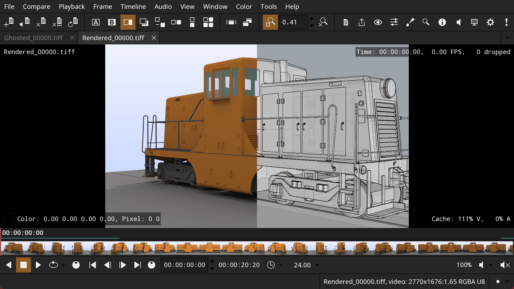
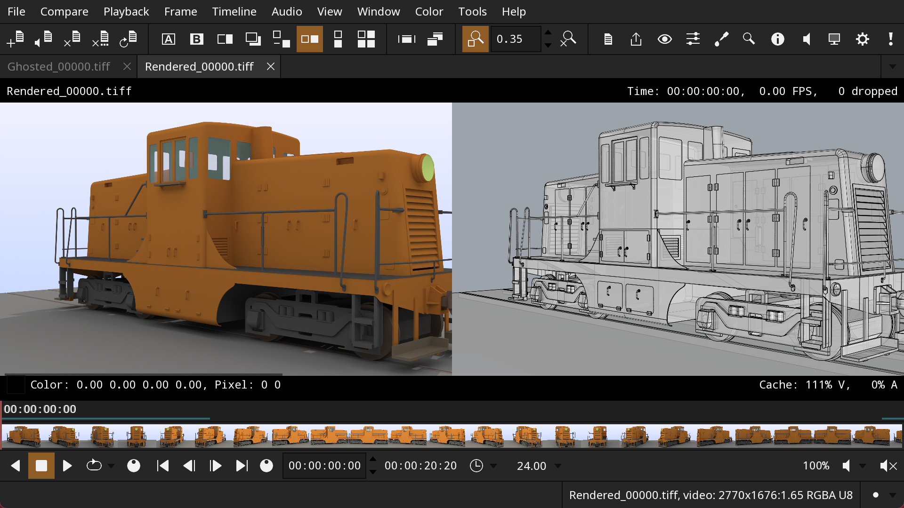

[](https://opensource.org/licenses/BSD-3-Clause)
[](https://github.com/grizzlypeak3d/DJV/actions/workflows/ci-workflow.yml)

# &nbsp;DJV

DJV is a free, open source media player built for professional image review. Real-time, high bit-depth EXR playback, A/B comparison, OTIO color management and more. 
Never compromise on your renders again.

CORE FEATURES:
* Support for high resolution and high bit depth images
* A/B comparison with wipe, overlay, and difference modes
* Timeline support with OpenTimelineIO
* Color management with OpenColorIO
* Multi-track audio with variable speed and reverse playback
* Experimental support for USD files
* Available for Linux, macOS, and Windows

[Documentation](https://grizzlypeak3d.github.io/DJV/index.html)

DJV is built with the [tlRender](https://github.com/grizzlypeak3d/tlRender) and
[feather-tk](https://github.com/grizzlypeak3d/feather-tk) libraries.

Example of two images being compared with a wipe:



Example of two images being compared with a horizontal layout:




## Downloads

https://github.com/grizzlypeak3d/DJV/releases

**NOTE**: Download packages only include a minimal set of video and audio
codecs. Additional codecs can be supported by using an external FFmpeg command
or building from source.


## Building

A CMake "super build" is provided to build DJV and the main dependencies. The
super build can be invoked with cripts as described below.

The scripts contain a number of options that can be edited to configure the
build, for example:

* Increase the number of jobs used for the build:
    * JOBS=16
* Enable full codec support:
    * TLRENDER_FFMPEG_MINIMAL=OFF
    * TLRENDER_FFMPEG_PLUGIN=ON
    * TLRENDER_FFMPEG_CMD=OFF
* Enable USD (Universal Scene Description) support:
    * TLRENDER_USD=ON

### Building on Linux

Requirements:
* CMake 3.31

#### Debian

Install system packages:
```
sudo apt-get install build-essential git cmake xorg-dev libglu1-mesa-dev mesa-common-dev mesa-utils libasound2-dev libpulse-dev
```

#### Rocky 9

Install system packages:
```
sudo dnf install libX11-devel libXrandr-devel libXinerama-devel libXcursor-devel libXi-devel mesa-libGL-devel pipewire-devel
```

#### Rocky 8

Install system packages:
```
sudo dnf install libX11-devel libXrandr-devel libXinerama-devel libXcursor-devel libXi-devel mesa-libGL-devel pipewire-devel
```
Install newer compiler:
```
sudo dnf install gcc-toolset-13
```
Enable newer compiler:
```
scl enable gcc-toolset-13 bash
```

#### Build

Clone the repository:
```
git clone https://github.com/grizzlypeak3d/DJV.git
```

Run the super build script:
```
sh DJV/sbuild-linux.sh DJV
```

Run the application:
```
build-Release/bin/djv/djv DJV/etc/SampleData/BART_2021-02-07.0000.jpg
```


### Building on macOS

Requirements:
* Xcode
* CMake 3.31

Clone the repository:
```
git clone https://github.com/grizzlypeak3d/DJV.git
```

Run the super build script:
```
sh DJV/sbuild-macos.sh DJV
```

Run the application:
```
build-Release/bin/djv/djv DJV/etc/SampleData/BART_2021-02-07.0000.jpg
```

These aliases are convenient for switching between architectures:
```
alias arm="env /usr/bin/arch -arm64 /bin/zsh --login"
alias intel="env /usr/bin/arch -x86_64 /bin/zsh --login"
```


### Building on Windows

Requirements:
* Visual Studio 2022
* CMake 3.31
* MSYS2 (https://www.msys2.org) for compiling FFmpeg.
* Strawberry Perl (https://strawberryperl.com/) for compiling network support.
* Python 3.11 for compiling USD.
* NSIS (https://nsis.sourceforge.io/Main_Page) for packaging.

Open the Visual Studio command console "x64 Native Tools Command Prompt for VS 2022".
This can be found in the Start menu, in the "Visual Studio 2022" folder.

Clone the repository:
```
git clone https://github.com/grizzlypeak3d/DJV.git
```

Run the super build script:
```
DJV\sbuild-win.bat DJV
```

Run the application:
```
set PATH=%CD%\install-Release\bin;%PATH%
```
```
build-Release\bin\djv\Release\djv DJV\etc\SampleData\BART_2021-02-07.0000.jpg
```
