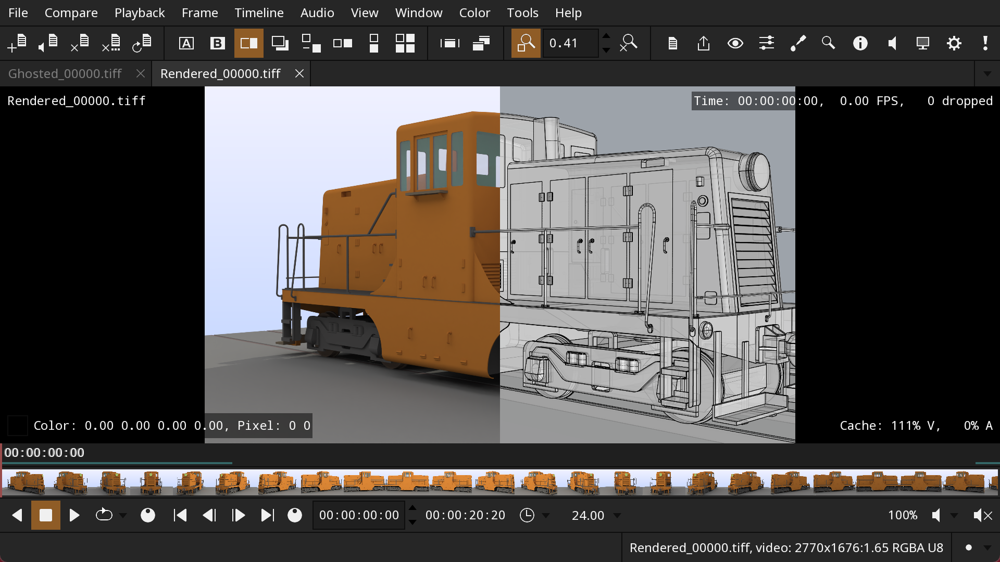
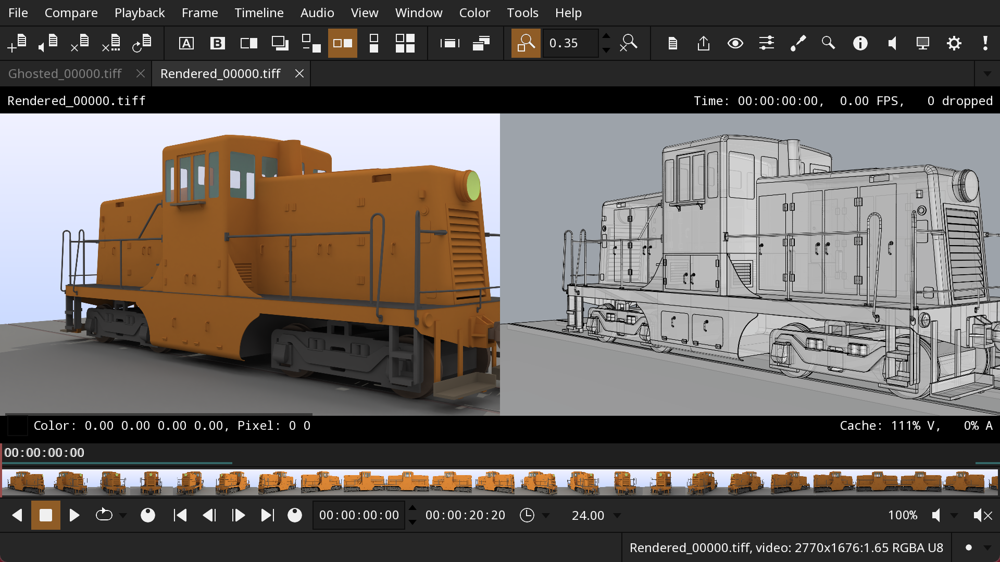

[](https://opensource.org/licenses/BSD-3-Clause)
[](https://github.com/grizzlypeak3d/DJV/actions/workflows/ci-workflow.yml)

# &nbsp;DJV

DJV is a free, open source media player built for professional image review. Real-time, high bit-depth EXR playback, A/B comparison, OTIO color management and more. 
Never compromise on your renders again.

CORE FEATURES:
* Support for high resolution and high bit depth images
* A/B comparison with wipe, overlay, and difference modes
* Timeline support with OpenTimelineIO
* Color management with OpenColorIO
* Multi-track audio with variable speed and reverse playback
* Experimental support for USD files
* Available for Linux, macOS, and Windows

[Documentation](https://grizzlypeak3d.github.io/DJV/index.html)

DJV is built with the [tlRender](https://github.com/grizzlypeak3d/tlRender) and
[feather-tk](https://github.com/grizzlypeak3d/feather-tk) libraries.

Example of two images being compared with a wipe:



Example of two images being compared with a horizontal layout:




## Downloads

https://github.com/grizzlypeak3d/DJV/releases

**Note:** Download packages include only a minimal set of video and audio
codecs. To support additional codecs, point DJV at an external FFmpeg
command (see [documentation](https://grizzlypeak3d.github.io/DJV/index.html#files))
or build from source.


## Building

DJV is built with CMake. A super build is provided that builds the
dependencies and then DJV, driven by a script per platform:

```
sh DJV/sbuild-linux.sh
sh DJV/sbuild-macos.sh
DJV\sbuild-win.bat
```

The system packages each platform needs, the options, and building against
a distribution's own packages are in the documentation:
https://grizzlypeak3d.github.io/DJV/building.html
