#  DJV

DJV is an open source application for media playback and review. DJV can
playback high resolution image sequences and movies in real time, with
audio, A/B comparison, color management, and more.

Features include:
* Support for high resolution and high bit depth images
* A/B comparison with wipe, overlay, and difference modes
* Timeline support with OpenTimelineIO
* Color management with OpenColorIO
* Multi-track audio with variable speed and reverse playback
* Experimental support for USD files
* Available for Linux, macOS, and Windows

<br>

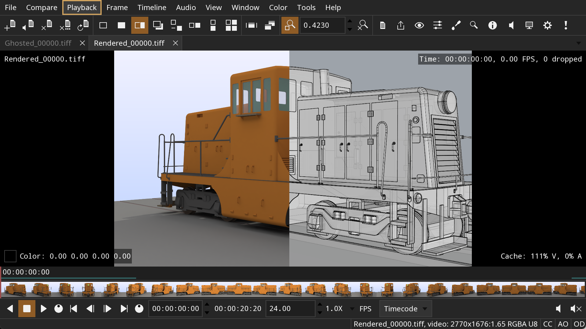


<br><br>
### Documentation

1. [Download and Install](#install)
2. [Main Window](#main_window)
4. [Files](#files)
3. [Viewport](#viewport)
5. [Playback and Frame Control](#playback)
6. [Timeline](#timeline)
7. [A/B Comparison](#compare)
8. [Color](#color)
9. [Exporting Files](#export)
10. [Settings](#settings)
11. [Keyboard Shortcuts](#shortcuts)
12. [Troubleshooting](#trouble_shoot)


<br><br><a name="install"></a>
## Download and Install

[Downloads](https://github.com/grizzlypeak3d/DJV/releases/)

**NOTE**: Download packages only include a minimal set of video and audio
codecs. To enable full support, either compile from source or replace the
FFmpeg shared libraries.

### Linux

Packages are distributed as tar archives. Uncompress the archive and move the
DJV folder to a convenient location.

### Windows

Packages are distributed as ZIP archives. Uncompress the archive and move the
DJV folder to a convenient location.

### macOS

Packages are distributed as macOS disk images. Open the disk image and copy
DJV to the "Applications" folder.


<br><br><a name="main_window"></a>
## Main Window

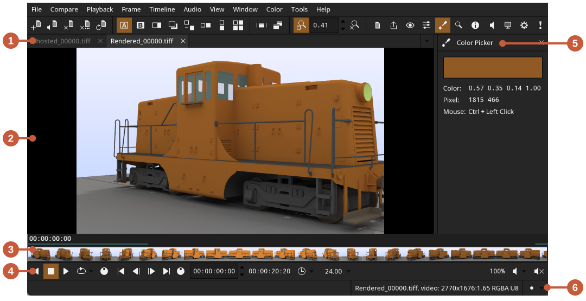

Main window:
1. Tab Bar - Switch between currently opened files
2. Viewport - View of the current file
3. Timeline - Time scrubbing, thumbnails, and audio waveforms
4. Playback - Playback and frame controls
5. Tool - Current tool (e.g. color picker or magnifier)
6. Status Bar - Warnings and errors, information about the current file, indicators

Parts of the user interface can be toggled on and off from the **Window** menu.

Full screen mode can be enabled from the **Window** menu.

A secondary window can be used to mirror the viewport on a separate monitor.
The secondary window can be shown from the **Window** menu.


<br><br><a name="files"></a>
## Files

Supported file formats:
* Image sequences: Cineon, DPX, JPEG, OpenEXR, PNG, PPM, SGI, TGA, BMP, TIFF
* Default movie codecs: MJPEG, MPEG-2
* Default audio codecs: FLAC, MP3, WAV
* Timelines: OTIO, OTIOZ
* Experimental: USD

Files and folders can be opened from the **File** menu, by dragging and
dropping onto the main window, or from the command line. Opening a folder will
open all of the supported files in the folder (non-recursively).

Image sequences can be opened from the command line by either specifying the
first frame or using the "#" wildcard. For example:
```
djv render.#.exr
```

The native file browser is enabled by default on Windows and macOS. The
built-in file browser can be enabled in the **Settings** tool.

The current file can be changed from the **File/Current** menu, the
**Tab Bar**, or the **Files** tool.

### Memory Cache

The memory cache can be configured in the **Settings** tool. There are
separate values for video, audio, and "read behind". The "read behind"
value is the number of seconds that are read before the current frame. This
is useful to ensure frames are cached when scrubbing.

Only the current file is stored in the cache. When the current file is
changed, it is unloaded from the cache and the new file is loaded.

### Layers

For files that contain multiple layers (i.e., OpenEXR), the current layer can
be changed from the **File/Layers** menu or the **Files** tool.

### Files Tool

The **Files** tool can be used to set the current file, the current layers, and
compare options.

The **Files** tool can be shown from the **Tools** menu or the tool bar.

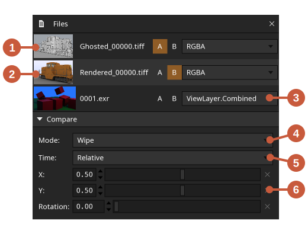

Files tool:
1. The current file (**A** file)
2. The **B** files (multiple "B" files may be set for tile mode)
3. The current layer of the file
4. Compare mode
5. Compare time
6. Compare options

### Image Sequences and Audio

Audio can be added to image sequences either automatically or explicitly.

To automatically add audio to image sequences, open the **Image Sequences**
section in the **Settings Tool**. Audio files can be found by either specifying
the file extensions to search for (e.g., ".wav .mp3"), or providing a specific
file name.

To explicitly add audio to an image sequence use the
**File/Open With Audio** menu.

### USD

USD file support is currently experimental. When a USD file is opened it
is rendered to an image sequence with the Hydra renderer.

The camera used to render the scene will be chosen in this order:
1. If the USD file is referenced from an OTIO file, the name of the clip
2. The primary camera in the scene
3. The first camera found in the scene
4. A temporary camera is created that frames the scene


<br><br><a name="viewport"></a>
## Viewport

The viewport shows a view of the current file. The view can be panned, zoomed,
or "framed" so the image fills the view.

Viewport controls:
* Pan - Middle mouse button
* Zoom - Mouse wheel or keyboard shortcuts **-** and **=**
* Frame view - Keyboard shortcut **Backspace**
* Wipe in compare mode - **Alt** + left mouse button
* Color picker - **Ctrl** + left mouse button
* Frame shuttle - Left mouse button

The viewport controls can be customized in the **Settings** tool.

The bit depth of the viewport can be set in the **View** tool with the color
buffer option. The default option of **RGBA F32** is recommended to avoid
clamping color values. The other opions may be used for extra performance
but with possible color clamping.

The background color of the viewport can be set in the **View** tool. An
outline can also be drawn around the image to disinguish it from the
background, which can be useful for images with transparency.

### Grid

The grid can be enabled from the **View** tool.

Grid options:
* Enabled: Toggle the grid on or off
* Size: Number of pixels between grid lines
* Line width: Width of the grid lines
* Color: Color of the grid lines
* Labels:
    * None: No labels
    * Pixels: Pixel positions
    * Alphanumeric: Letters in the X direction and numbers in the Y direction (e.g., "B 12")
* Text color: Label text color
* Overlay color: Label background color

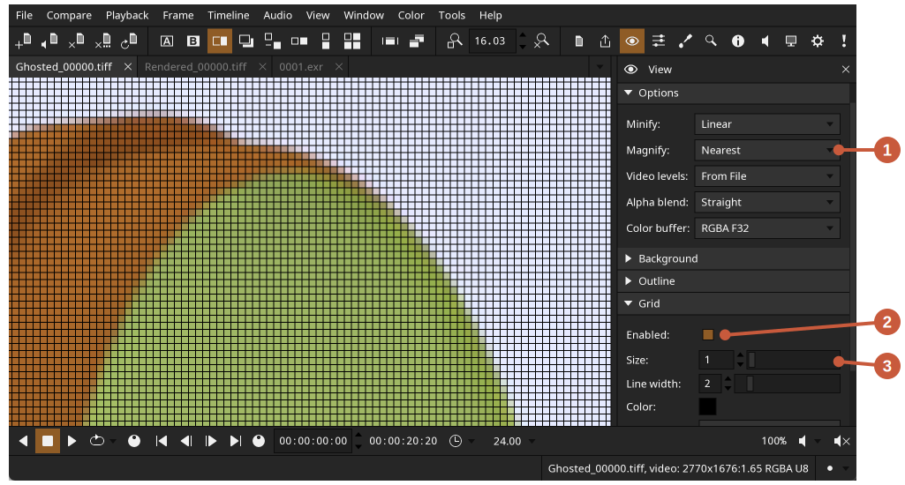

The grid can be used to examine individual pixels with these settings:
1. Set **Magnify** to **Nearest**
2. Enable the grid
3. Set the grid size to one

### HUD

Information can be overlaid on the viewport by enabling the HUD (heads up
display). The HUD can be enabled from the **View** menu.

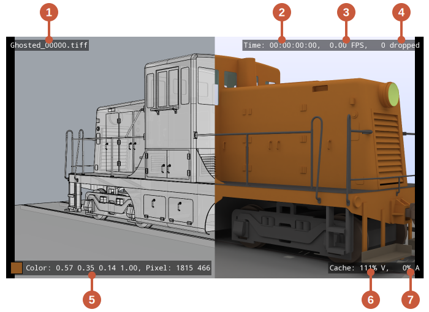

HUD:
1. Current file name
2. Current frame
3. Real playback speed
4. Number of frames dropped during playback
5. Color picker
6. Video cache percentage
7. Audio cache percentage


<br><br><a name="playback"></a>
## Playback and Frame Control

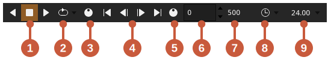

Playback and frame controls:
1. Playback controls
2. Playback shuttle - Click and drag to change playback speed
3. Frame controls
4. Frame shuttle - Click and drag to change the current frame
5. Current frame
6. Duration
7. Current speed
8. Speed multiplier
9. Time units (e.g., frames or timecode)

The playback speed can be changed momentarily by clicking forward or reverse
multiple times. The speed will accelerate 2X with each click, and can be
slowed down by clicking the opposite playback direction. The speed "multiplier"
is displayed with the other playback controls.

In and out points can be set frome the **Playback** menu to limit playback to a
section of the timeline.

The number of dropped frames during playback can be viewed in the HUD, which is
available from the **View** menu.


<br><br><a name="timeline"></a>
## Timeline

By default the timeline is minimized, showing only the first video and audio
track. To see all of the tracks in the timeline, toggle the minimized state
available from the **Timeline** menu.

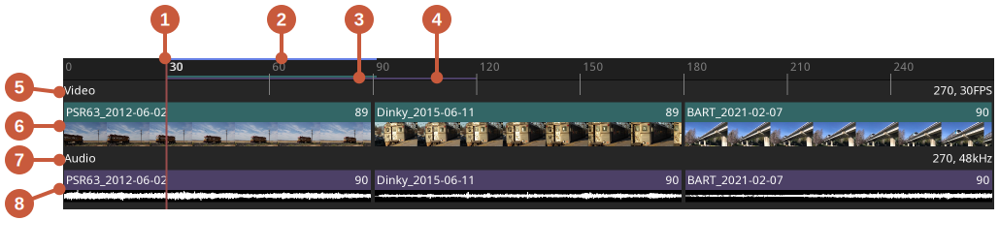

Timeline:
1. Current frame
2. In/out range (blue)
3. Video cache display (green)
4. Audio cache display (purple)
5. Video track
6. Video clips
7. Audio track
8. Audio clips

Timeline controls:
* Change the current frame - Left mouse button
* Zoom - Mouse wheel or keyboard shortcuts **-** and **=**
* Frame view - Keyboard shortcut **Backspace**
* Pan - Middle mouse button

The size of the timeline thumbnails can be set from the **Timeline** menu.
Thumbnails can also be disabled to improve performance.


<br><br><a name="compare"></a>
## A/B Comparison

To compare files, open both files and set the **B** file from either the
**Compare/B** menu or **Files** tool. The **A** file is the current file.

Compare modes:
* A - Show only the **A** file
* B - Show only the **B** file
* Wipe - Wipe between the **A** and **B** files
* Overlay - Show the **B** file over the **A** file
* Difference - Show the difference between the **A** and **B** files
* Horizontal - Show the **A** and **B** files side by side
* Vertical - Show the **A** and **B** files over and under
* Tile - Show the **A** and **B** files as tiles

Multiple **B** files can be viewed with **Tile** mode.

One example use for **Tile** mode is to simultaneously view multiple layers
within a file. Open the file multiple times and set the current layer for
each instance. Then enable **Tile** compare mode and set the "B" files.

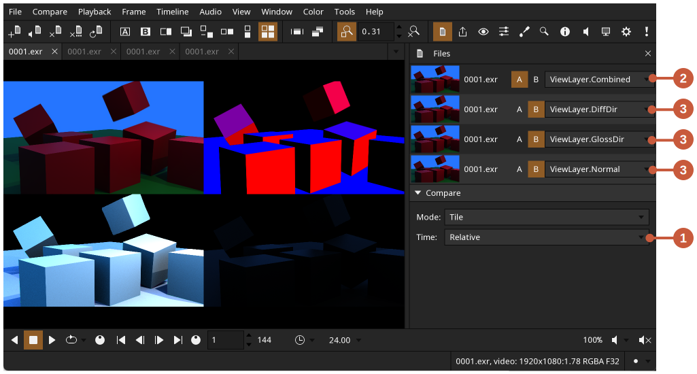

Compare multiple layers:
1. Set the compare mode to **Tile**
2. Set the current file and layer
3. Set multiple **B** files and their layers

Files can be compared in relative or absolute time mode. In relative time mode
the time of the **B** file will be offset to match the start of the **A** file.
In absolute time mode the **A** and **B** times will be the same.


<br><br><a name="color"></a>
## Color

The **Color** tool can be used to set OpenColorIO options, specify a
LUT (Look-Up Table), or apply other controls like brightness, contrast, and
levels.

The **Color** tool can be shown from the **Tools** menu or the tool bar.

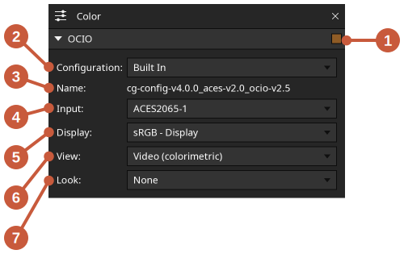

OpenColorIO options:
1. Enable OpenColorIO
2. OpenColorIO configuration
3. Configuration name
4. Input color space
5. Display color space
6. View color space
7. Look color space

The OpenColorIO configuration can be set to a built-in configuration, the
**OCIO** environment variable, or a file name.

A LUT file can also be applied either before or after the OpenColorIO pass, by
setting the LUT **Order** option to **PreColorConfig** or **PostColorConfig**.


<br><br><a name="export"></a>
## Exporting Files

The **Export** tool can be used to export the current file as an image
sequence, a movie, or the current frame as a still image.

The **Export** tool can be shown from the **Tools** menu or the tool bar.

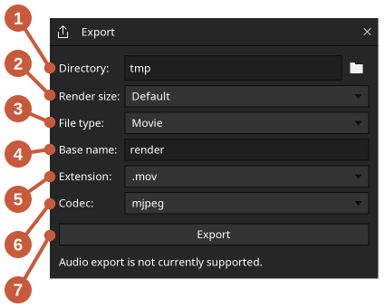

Export:
1. Output directory
2. Render size
3. File type
4. Base file name
5. File extension
6. Movie codec
7. Export button

To export an image sequence set the file type to **Sequence**. To export the
current frame set the file type to **Image**.

The current layer, playback speed, in/out range, and color settings will be
exported.

Note that audio export is not yet supported.


<br><br><a name="settings"></a>
## Settings

Settings are stored as a JSON file in the **DJV** folder in your **Documents**
directory.


<br><br><a name="shortcuts"></a>
## Keyboard Shortcuts

Keyboard shorcuts can be customized in the **Settings** tool.

The **Settings** tool can be shown from the **Tools** menu or the tool bar.

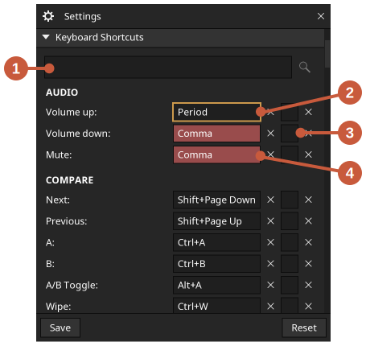

Keyboard shortcuts:
1. Keyboard shortcuts settings
2. Seach shortcuts
3. Shortcut with keyboard focus
4. Secondary shortcut
5. Conflicting shortcuts

To set a shortcut, click the shortcut widget or use the tab key to give it
keyboard focus, then type the new shortcut. The widget will turn red if the
shortcut conflicts with another one.


<br><br><a name="trouble_shoot"></a>
## Troubleshooting

Check the log file located in the **DJV** folder in your **Documents**
directory.

If the application fails to start, try running from the command line to check
for are any errors:
```
djv -log
```

Reset the settings:
* Delete the **DJV** folder in your **Documents** directory
* Or pass the **-resetSettings** flag on the command line
