#  DJV

DJV is an open source application for media playback and review. DJV can
play back high resolution image sequences and movies in real time, with
audio, A/B comparison, color management, and more.

Features include:
* High-resolution and high bit-depth image support
* A/B comparison with wipe, overlay, difference, and tile modes
* Timeline support via OpenTimelineIO
* Color management via OpenColorIO
* Multi-track audio with variable-speed and reverse playback
* Experimental USD support
* Available for Linux, macOS, and Windows

<br>


<br><br>
### Documentation

1. [Download and Install](#install)
2. [Main Window](#main_window)
3. [Files](#files)
4. [Viewport](#viewport)
5. [Playback and Frame Control](#playback)
6. [Timeline](#timeline)
7. [A/B Comparison](#compare)
8. [Color](#color)
9. [Exporting Files](#export)
10. [Settings](#settings)
11. [Troubleshooting](#trouble_shoot)


<br><br><a name="install"></a>
## Download and Install

[Downloads](https://github.com/grizzlypeak3d/DJV/releases/)

**Note:** Download packages include only a minimal set of video and audio
codecs. To support additional codecs, point DJV at an external FFmpeg
command (see below) or build from source.

### Linux

Packages are distributed as tar archives. Uncompress the archive and move the
DJV folder to a convenient location.

### Windows

Packages are distributed as NSIS installers or ZIP archives. Double-click
the NSIS `.exe` file to start the installer, or, for ZIP archives,
uncompress the archive and move the DJV folder to a convenient location.

### macOS

Packages are distributed as macOS disk images. Open the disk image and
copy DJV to the **Applications** folder.


<br><br><a name="main_window"></a>
## Main Window

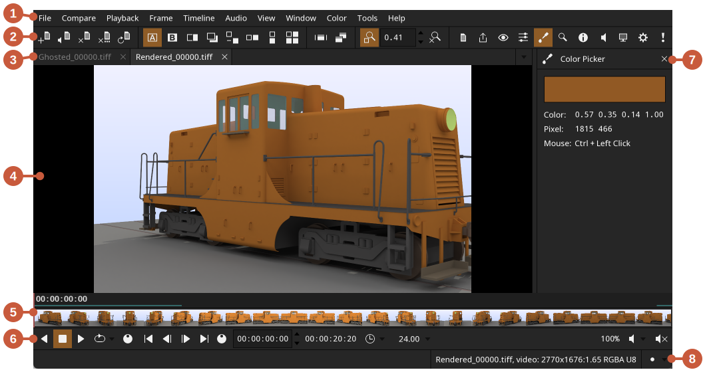

1. Tab Bar - Switch between currently opened files
2. Viewport - View of the current file
3. Timeline - Time scrubbing, thumbnails, and audio waveforms
4. Playback - Playback and frame controls
5. Tool - The currently active tool (for example, color picker or magnifier)
6. Status Bar - Warnings and errors, information about the current file, and
   status indicators

Most parts of the interface can be shown or hidden from the **Window** menu.

Full screen mode can be enabled from the **Window** menu or **Window** tool bar.

A secondary window can be used to mirror the viewport on a separate monitor —
useful for client review on a calibrated display. The secondary window can be
shown from the **Window** menu or **Window** tool bar.


<br><br><a name="files"></a>
## Files

DJV ships with support for the following formats:
* Image sequences: Cineon, DPX, JPEG, OpenEXR, PNG, PPM, SGI, TGA, BMP, TIFF
* Movie codecs: MJPEG, MPEG-2
* Audio codecs: FLAC, MP3, WAV
* Timelines: OTIO, OTIOZ
* Experimental: USD

More formats may be available depending on how DJV was built, or by using an
external FFmpeg command.

### Opening files

You can open files and folders in three ways:

* From the **File** menu or **File** tool bar
* By dragging and dropping onto the main window
* From the command line

Opening a folder opens every supported file in that folder (non-recursively).

Image sequences can be opened from the command line by either specifying the
first frame or using the "#" wildcard. For example:
```
djv render.#.exr
```

The native file browser is enabled by default on Windows and macOS. To use
DJV's built-in file browser instead, change the option in the **Settings** tool.

To switch between open files, use the **File/Current** menu, the **Tab Bar**,
or the **Files** tool.

### FFmpeg command

To support additional formats and codecs, you can configure DJV to use an
external FFmpeg command. FFmpeg runs as a sub-process and streams decoded
video and audio to DJV for display.

The paths to the **ffmpeg** and **ffprobe** commands are set in the
**Settings** tool.

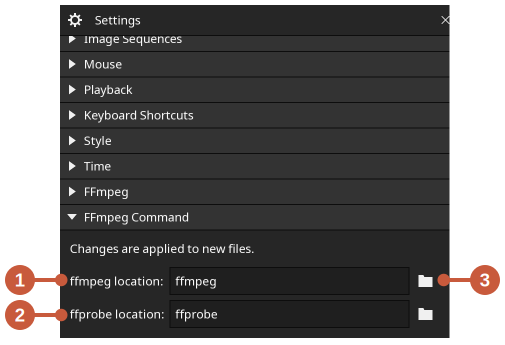

1. ffmpeg command location (click to show full path)
2. ffprobe command location (click to show full path)
3. Click to show file browser

### Memory cache

DJV caches frames in memory for smooth playback and scrubbing. The cache is
configured in the **Settings** tool, with separate values for video, audio,
and *read-behind*. Read-behind is the number of seconds cached *before* the
current frame, which keeps scrubbing responsive when moving backward.

Only the current file is cached. Switching files clears the cache and
reloads it for the new file.

### Layers

For files with multiple layers (such as multi-part OpenEXR), the active
layer can be changed from the **File/Layers** menu or from the **Files** tool.

### Files tool

The **Files** tool is the central place for managing open files: it sets the
current file, picks active layers, and configures comparison. Open it from
the **Tools** menu or the tool bar.

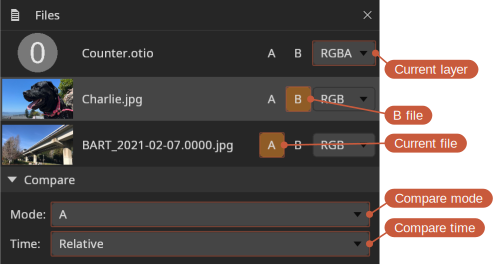

1. **Current file** (the **A** file)
2. **B files** (multiple **B** files can be set in tile mode)
3. Current layer
4. Compare mode
5. Compare time
6. Compare options

### Image sequences with audio

Audio can be paired with an image sequence either automatically or manually.

To pair audio automatically, open the **Image Sequences** section in the
**Settings** tool. You can either list the file extensions DJV should look
for (for example, `.wav .mp3`), or provide a specific file name to match.

To pair audio manually, use **File/Open With Audio**.

### USD

USD support is currently experimental. When a USD file is opened, DJV
renders it to an image sequence using the Hydra renderer.

DJV picks the rendering camera in this order:

1. The clip name, if the USD file is referenced from an OTIO file
2. The primary camera in the scene
3. The first camera found in the scene
4. A temporary camera generated to frame the scene


<br><br><a name="viewport"></a>
## Viewport

The viewport displays the current file. You can pan, zoom, or *frame* the
view so the image fills the available space.

Default viewport controls:
* **Pan** — Middle mouse button
* **Zoom** — Mouse wheel, or the **-** and **=** keys
* **Frame view** (fit image to viewport) — **Backspace**
* **Wipe** (in compare mode) — **Alt** + left mouse button
* **Color picker** — **Ctrl** + left mouse button
* **Frame shuttle** (scrub frames by dragging) — Left mouse button

Viewport controls can be remapped in the **Settings** tool.

### Color buffer

The viewport's bit depth is set in the **View** tool with the **Color buffer**
option. The default, **RGBA F32**, is recommended because it preserves the
full range of color values without clamping. Lower bit-depth options can be
faster, but they will clamp colors — choose them only when performance is
more important than precision.

### Background

The viewport background color is set in the **View** tool. You can also
draw an outline around the image, which makes images with transparent
regions easier to distinguish from the background.

### Grid

The grid is enabled and configured from the **View** tool.

Grid options:
* **Enabled** — Toggle the grid on or off
* **Size** — Pixels between grid lines
* **Line width** — Thickness of the grid lines
* **Color** — Color of the grid lines
* **Labels** — How cells are labeled:
    * **None** — No labels
    * **Pixels** — Pixel positions
    * **Alphanumeric** — Letters along X, numbers along Y (e.g., "B 12")
* **Text color** — Label text color
* **Overlay color** — Label background color

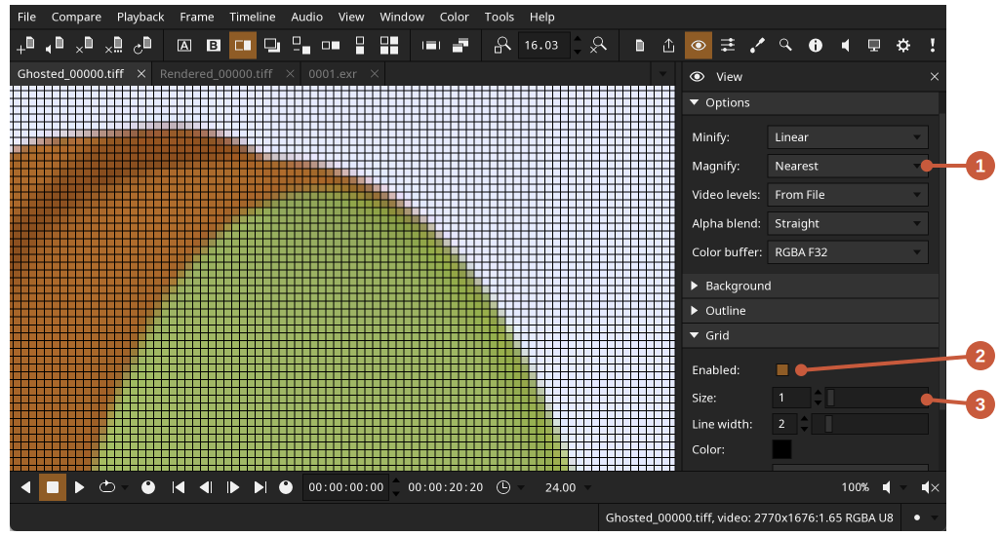

The grid can also help you inspect individual pixels. To do so:
1. Set **Magnify** to **Nearest**
2. Enable the grid
3. Set the grid size to `1`

### HUD

The heads-up display (HUD) overlays useful information on top of the
viewport. Enable it from the **View** menu.

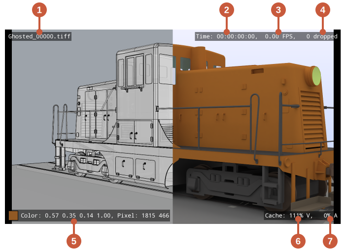

1. Current file name
2. Current frame
3. Actual playback speed (the rate DJV is achieving, which may differ from the requested rate)
4. Number of frames dropped during playback
5. Color picker
6. Video cache fill (%)
7. Audio cache fill (%)


<br><br><a name="playback"></a>
## Playback and Frame Control

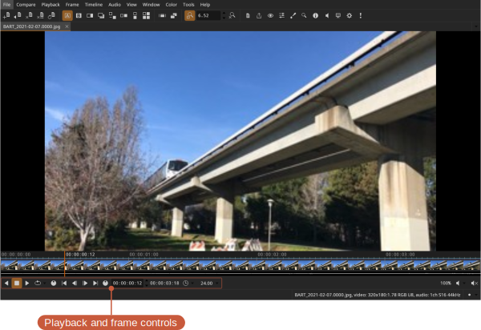

1. Playback controls (forward/reverse/stop)
2. Playback loop mode
3. Playback shuttle - Click and drag to vary playback speed
4. Frame controls (step, jump to start/end)
5. Frame shuttle - Click and drag to scrub the current frame
6. Current frame
7. Duration
8. Time units (e.g., frames or timecode)
9. Current speed

### Speed multiplier

You can temporarily speed up playback by clicking the forward (or reverse)
button repeatedly: each click doubles the playback speed. Clicking the
opposite direction slows it back down.

### In and out points

To limit playback to a section of the timeline, set in and out points from
the **Playback** menu.

### Dropped frames

If playback isn't keeping up, the HUD (under the **View** menu) shows the
number of dropped frames in real time.


<br><br><a name="timeline"></a>
## Timeline

By default, the timeline is minimized and shows only the first video and
audio track. To see every track, toggle the minimized state from the
**Timeline** menu.

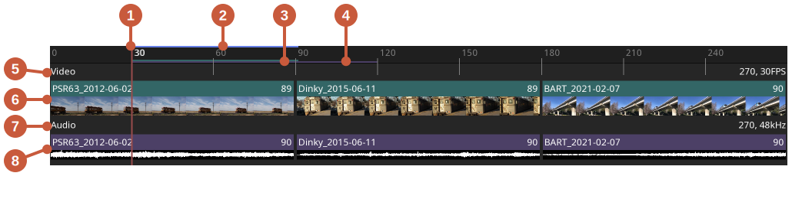

1. Current frame
2. In/out range (blue)
3. Video cache (green)
4. Audio cache (purple)
5. Video track
6. Video clips
7. Audio track
8. Audio clips

Default timeline controls:
* **Change current frame** — Left mouse button
* **Zoom** — Mouse wheel, or the **-** and **=** keys
* **Frame view** — **Backspace**
* **Pan** — Middle mouse button

The size of the timeline thumbnails is set from the **Timeline** menu, and
thumbnails can be turned off entirely to improve performance.


<br><br><a name="compare"></a>
## A/B Comparison

A/B comparison lets you view two files (or layers) at once — useful for
checking revisions, matching color between shots, or spotting differences
between renders.

### Setting up a comparison

1. Open the files in DJV.
2. The current file is the **A** file. Set the **B** file from the
   **Compare/B** menu or the **Files** tool.
3. Pick a compare mode (see below).

### Compare modes

| Mode | What it shows |
|---|---|
| **A** | Only the **A** file |
| **B** | Only the **B** file |
| **Wipe** | A wipe between **A** and **B** (drag with **Alt** + left mouse button) |
| **Overlay** | **B** layered on top of **A** |
| **Difference** | The pixel difference between **A** and **B** |
| **Horizontal** | **A** and **B** side by side |
| **Vertical** | **A** above **B** |
| **Tile** | **A** and **B** as tiles (supports multiple **B** files) |

### Compare time

Files can be compared in either *relative* or *absolute* time:

* **Relative** — The **B** file is offset so its start aligns with the
  start of **A**.
* **Absolute** — **A** and **B** play at the same timeline time.

### Comparing multiple layers (tile mode example)

Tile mode supports multiple **B** files, which makes it handy for viewing
several layers of a single file at once. Open the file multiple times and
set a different active layer for each instance, then enable **Tile**
compare mode and add the other instances as **B** files.

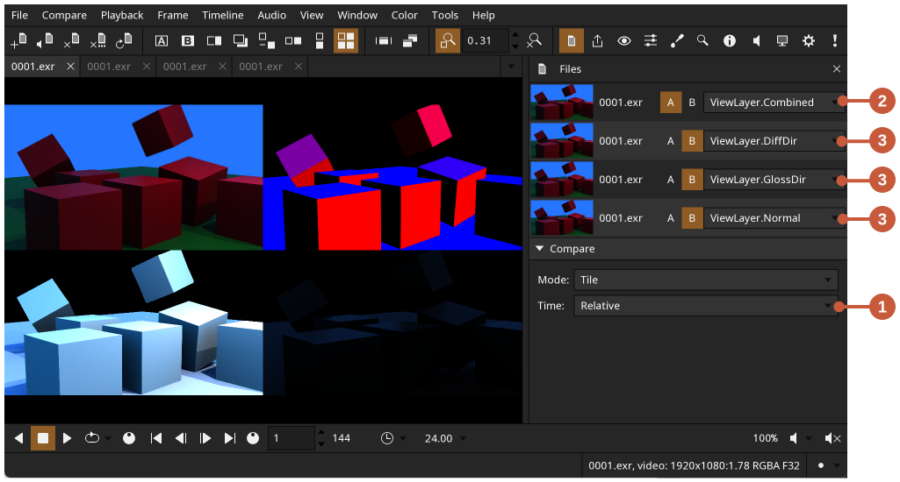

1. Set the compare mode to **Tile**
2. Set the current file and its layer
3. Add the **B** files and pick a layer for each


<br><br><a name="color"></a>
## Color

The **Color** tool covers everything color-related: OpenColorIO settings,
LUTs (look-up tables), and basic adjustments such as brightness, contrast,
and levels.

Open it from the **Tools** menu or the tool bar.

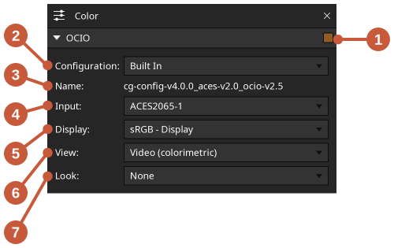

1. Enable OpenColorIO
2. OpenColorIO configuration
3. Configuration name
4. Input color space
5. Display color space
6. View color space
7. Look color space

The OpenColorIO configuration can be set to a built-in configuration, the
**OCIO** environment variable, or a specific file path.

A LUT can be applied either before or after the OpenColorIO pass — set the
LUT **Order** option to **PreColorConfig** or **PostColorConfig** as needed.


<br><br><a name="export"></a>
## Exporting Files

The **Export** tool writes out the current file as an image sequence, a
movie, or a single still image.

Open it from the **Tools** menu or the tool bar.

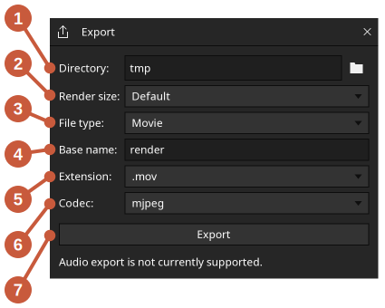

1. Output directory
2. Render size
3. File type
4. Base file name
5. File extension
6. Movie codec
7. Export button

To export an image sequence, set **File type** to **Sequence**. To export
just the current frame, set it to **Image**.

Exports respect the current layer, playback speed, in/out range, and color
settings.

> **Note:** Audio export is not yet supported.


<br><br><a name="settings"></a>
## Settings

Open the **Settings** tool from the **Tools** menu or the tool bar.

Settings are stored as a JSON file in the **Documents/DJV** directory.

### Keyboard Shortcuts

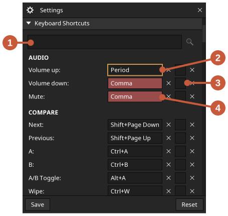

1. Search shortcuts
2. Shortcut with keyboard focus
3. Secondary shortcut
4. Conflicting shortcuts

To set a shortcut, click its widget (or tab to it) and press the new key
combination. The widget turns red if the chosen combination conflicts with
an existing shortcut.

### Language Support

The default fonts shipped with DJV don't cover every language, which can
cause file names in some scripts to display incorrectly. To support
additional languages — Chinese, Japanese, and Korean, for example — add
custom fonts in the **Style** section of the **Settings** tool.

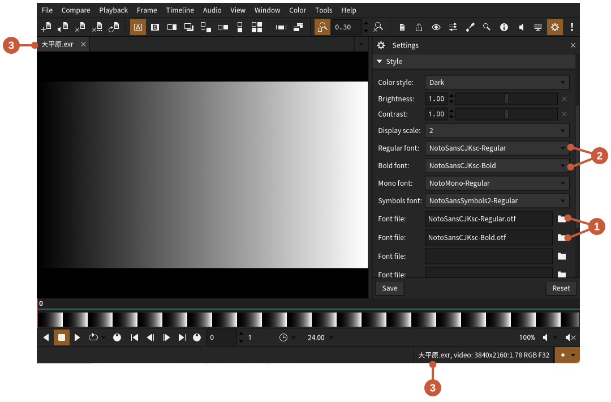

1. Add custom fonts
2. Set custom fonts
3. File names using custom fonts


<br><br><a name="trouble_shoot"></a>
## Troubleshooting

If something isn't working, the log file in the **Documents/DJV** directory
is the first place to look.

If DJV fails to start, run it from the command line to see startup errors:
```
djv -log
```

If the application is misbehaving, try resetting the settings:
* Delete the directory **Documents/DJV**
* Or pass the **-resetSettings** flag on the command line
